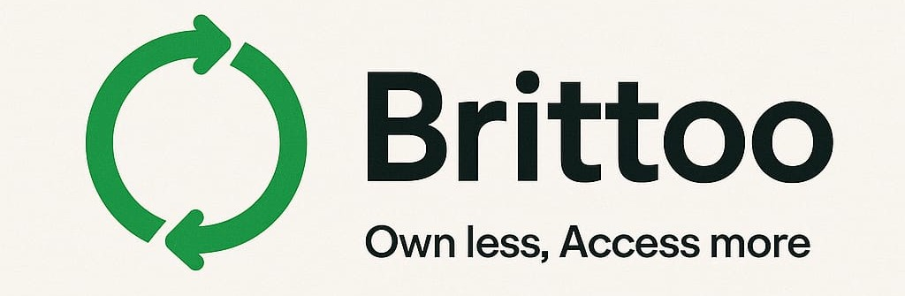

<br>

Brittoo is a modern full-stack rental platform that allows users to list, discover, and manage rentals seamlessly. Whether it's a home, car, or service, Brittoo simplifies the rental experience for both owners and renters.

<br>


## 🛠️ Tech Stack

### 🖥️ Frontend
- **React 19**
- **Tailwind CSS 4**
- **React Router v7**
- **Flowbite React**
- **Zustand**
- **React Icons**
- **Tailwind Scrollbar Hide**
- **Vite (via Tailwind plugin)**

### ⚙️ Backend
- **Node.js**
- **Express v5**
- **Prisma ORM v6**
- **PostgreSQL**
- **BcryptJS**
- **JSON Web Token (JWT)**
- **Resend API**
- **dotenv**
- **Jest**
- **Supertest**
- **Nodemon**

### 🐳 Docker
- **Multi-stage Dockerfile for client (build + Nginx serve)**
- **Express API Docker container**
- **PostgreSQL container**
- **Docker Compose for orchestration**

### 🧱 Infrastructure
- **Volumes for PostgreSQL data persistence**
- **Nginx for serving frontend (production)**
- **ENV files for secure config**

<br>

## 🚀 Setup
```bash
./setup.sh
```

## 💻 Development Commands

### Build
```bash
## build all
./dev.sh build all

## build client
./dev.sh build client

## build server
./dev.sh build server
```

<br>

### Run
```bash
## run all
./dev.sh run all

## run client
./dev.sh run client

## run server
./dev.sh run server
```
<br>

### Stop
```bash
## stop all
./dev.sh stop all

## stop client
./dev.sh stop client

## stop server
./dev.sh stop server
```


<br>


## 📌 Status

🚧 Currently under development.  
🧪 Targeting a stable MVP release soon.

---

<br>
<br>

### 📧 Contact
__Maintainer:__ Asadullah Al Galib 

__Email:__ aagalib2323@gmail.com

## 📎 License

This project is currently private and under active development 😭

